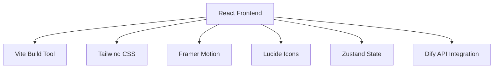

# AI商业内容解析平台 - 技术架构文档

## 1. Architecture Design



## 2. Technology Description

- **Frontend**: React@18 + TypeScript + Vite
- **Styling**: Tailwind CSS@3
- **Animations**: Framer Motion
- **Icons**: Lucide React
- **State Management**: Zustand
- **Initialization Tool**: vite-init
- **Backend**: Dify Workflow API (预留接口)

## 3. Route Definitions

| Route | Purpose |
|-------|---------|
| /     | 首页（主页面） |

## 4. API Definitions (Dify Integration)

```typescript
// 输入数据结构
interface InputData {
  file?: File;
  url?: string;
  settings?: {
    analysisDepth: 'basic' | 'detailed';
    outputStyle: 'professional' | 'casual';
  };
}

// Dify API 请求格式
interface DifyRequest {
  inputs: {
    content: string;
    analysisDepth: string;
    outputStyle: string;
  };
  user: string;
  response_mode: 'streaming' | 'blocking';
  conversation_id?: string;
}

// Dify API 响应格式
interface DifyResponse {
  event: 'message' | 'message_replace' | 'message_end' | 'error';
  data?: {
    answer: string;
    conversation_id: string;
    message_id: string;
    created_at: number;
  };
}

// 结果数据结构
interface AnalysisResult {
  originalContent: string;
  summary: {
    concise: string;
    detailed: string;
  };
  story: string;
  businessIdeas: BusinessIdea[];
}

interface BusinessIdea {
  title: string;
  description: string;
  steps: string[];
  costEstimate: string;
  riskMitigation: string;
  operationSuggestions: string;
}
```

## 5. Project Structure

```
business/
├── src/
│   ├── components/
│   │   ├── Hero.tsx
│   │   ├── UploadSection.tsx
│   │   ├── ProcessingStatus.tsx
│   │   ├── ResultsSection.tsx
│   │   ├── GlassCard.tsx
│   │   ├── SkeletonLoader.tsx
│   │   └── Footer.tsx
│   ├── hooks/
│   │   ├── useDifyApi.ts
│   │   └── useParticleBackground.ts
│   ├── pages/
│   │   └── Home.tsx
│   ├── store/
│   │   └── useAppStore.ts
│   ├── utils/
│   │   ├── fileUtils.ts
│   │   └── animationUtils.ts
│   ├── App.tsx
│   ├── main.tsx
│   └── index.css
├── public/
├── .trae/
│   └── documents/
│       ├── prd.md
│       └── arch.md
├── package.json
├── tsconfig.json
├── vite.config.ts
├── tailwind.config.js
└── postcss.config.js
```
